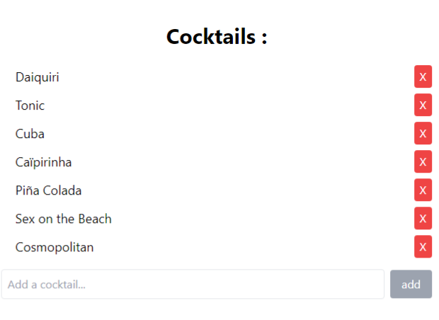

<h1 align="center"> 🍸 Cocktails List React 🍸 </h1>

### 🌐 Demo / Preview


---

### ✏️ **Description**
This project was one of my first exercises designed to learn React. I took the opportunity to integrate **Tailwind CSS**, which I had started exploring as a self-learner just prior to this.  

The project is a simple **Todolist-style application** intended to store cocktail names, for example, in a bar setting. While minimalist in design, it is functional and effective.

The powerful combination of **React**, **Tailwind CSS**, and **JSX** makes this a practical and efficient learning experience.

### 💻 **Technologies Used**
- **React**: For building the application structure and interactivity.
- **Tailwind CSS**: For rapid and simplified styling.
- **JSX**: For clean and readable component-based coding.
- **CSS**: For additional custom styles where needed.

### **Key Features** 🚀
🍹 **Cocktail storage**: Easily add and manage a list of cocktail names.

⚡ **React & Tailwind**: Quick and functional implementation using modern front-end tools.

🧑‍🏫 **Learning focus**: An introductory exercise for learning React with Tailwind CSS.

### 🛠️ **Installation & Usage**
1. Clone the repository:
   ```bash
   git clone https://github.com/HUYBERIC/CocktailsListReactTw.git
   cd CocktailsListReactTw
   ```

2. Install dependencies:
   ```bash
   npm install
   ```

3. Start the development server:
   ```bash
   npm start
   ```

4. Open `http://localhost:3000` in your browser to view the application.

<br>
<br>
<br>

---

<h1 align="center"> 🍸 Cocktails List React 🍸 </h1>

---

### ✏️ **Description**
Ce projet est l’un des premiers exercices que j’ai réalisés pour apprendre React. J’en ai profité pour intégrer **Tailwind CSS**, que j’avais commencé à explorer en autodidacte peu avant.  

L’application est une **Todolist simple** conçue pour stocker des noms de cocktails, par exemple dans un bar. Bien que minimaliste en termes de design, elle est fonctionnelle et efficace.

Le trio gagnant **React**, **Tailwind CSS**, et **JSX** fait de ce projet une expérience pratique et rapide à développer.

### 💻 **Technologies utilisées**
- **React** : Pour construire la structure et l’interactivité de l’application.
- **Tailwind CSS** : Pour un style rapide et simplifié.
- **JSX** : Pour un code clair et basé sur des composants.
- **CSS** : Pour des styles personnalisés supplémentaires si nécessaire.

### **Caractéristiques principales** 🚀
🍹 **Gestion des cocktails** : Ajoutez et gérez facilement une liste de noms de cocktails.

⚡ **React & Tailwind** : Mise en œuvre rapide et fonctionnelle avec des outils modernes du front-end.

🧑‍🏫 **Apprentissage en focus** : Un exercice introductif pour apprendre React avec Tailwind CSS.

### 🛠️ **Installation & Utilisation**
1. Cloner le dépôt :
   ```bash
   git clone https://github.com/HUYBERIC/CocktailsListReactTw.git
   cd CocktailsListReactTw
   ```

2. Installer les dépendances :
   ```bash
   npm install
   ```

3. Lancer le serveur de développement :
   ```bash
   npm start
   ```

4. Ouvrir `http://localhost:3000` dans votre navigateur pour voir l’application.
